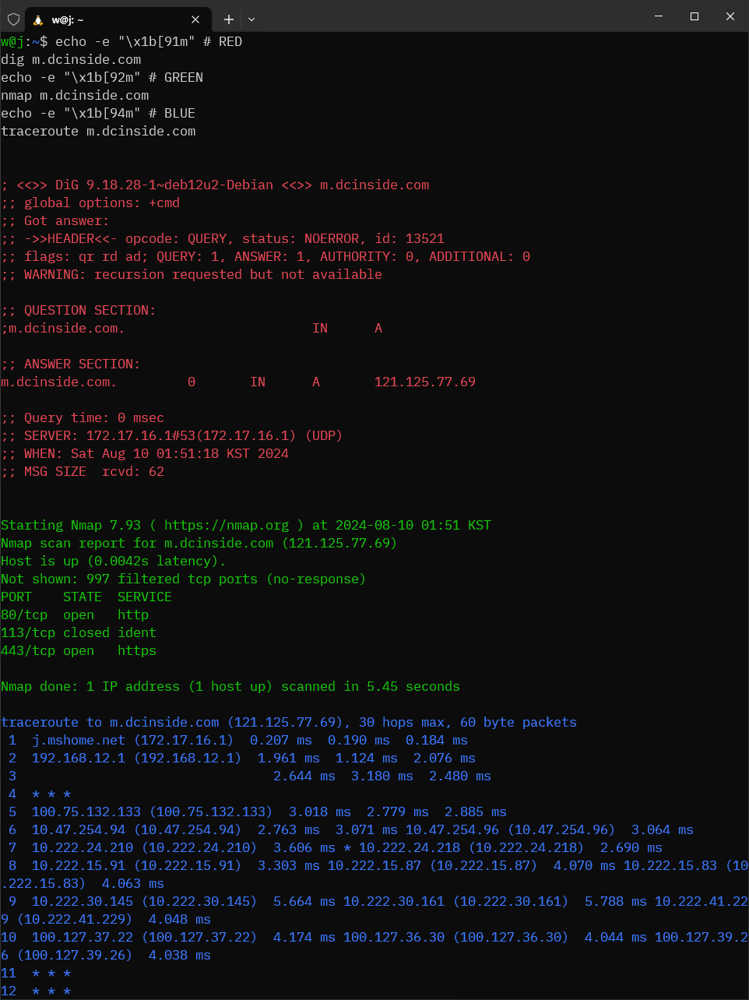

```sh
sudo apt-get update && sudo apt-get install -y dnsutils traceroute nmap

echo -e "\x1b[91m" # RED
dig m.dcinside.com

echo -e "\x1b[92m" # GREEN
nmap m.dcinside.com

echo -e "\x1b[94m" # BLUE
traceroute m.dcinside.com
```

## Expected Result

